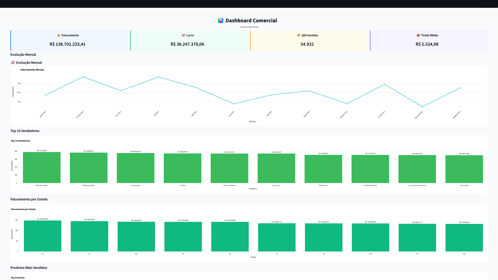

# 📊 Dashboard Comercial | Python + SQL Server + PostgreSQL + Streamlit

<p align="center">


</p>

---

## 📌 Sobre o Projeto

Dashboard interativo para análise comercial desenvolvido utilizando **Python, Streamlit, SQL Server, PostgreSQL (Neon), Pandas e Plotly**, simulando um ambiente real de **Business Intelligence** e **Engenharia de Dados**.

O projeto foi construído de ponta a ponta, desde a geração dos dados até a disponibilização do dashboard em ambiente cloud.

---
## 🚀 Acesse a aplicação

🔗 [https://dashboardvendasbi2.streamlit.app](https://dashboardvendasbi2.streamlit.app/)
---

# 📷 Dashboard



---

## 🚀 Arquitetura do Projeto

```text
Dados Fictícios (Faker)
            ↓
SQL Server Local
            ↓
Modelagem Dimensional
            ↓
Views Analíticas
            ↓
ETL com Python + Pandas
            ↓
PostgreSQL (Neon Cloud)
            ↓
Streamlit + Plotly
            ↓
Dashboard Interativo
```

---

# 🛠 Tecnologias Utilizadas

### Linguagens e Bibliotecas

- Python
- Pandas
- Streamlit
- Plotly
- Faker
- SQLAlchemy
- Psycopg2

### Bancos de Dados

- SQL Server
- PostgreSQL
- Neon Database

### Conceitos Aplicados

- ETL
- Data Warehouse
- Modelagem Dimensional
- Business Intelligence
- Data Visualization
- Cloud Database

---

# 🔄 Engenharia de Dados

## Geração dos Dados

Os dados utilizados no projeto foram gerados com a biblioteca **Faker**, simulando um ambiente comercial real contendo:

- Clientes
- Produtos
- Categorias
- Vendedores
- Vendas
- Estoque
- Devoluções

Objetivo:

Criar uma base consistente para análises e desenvolvimento do dashboard.

---

## 🗄️ Data Warehouse SQL Server

Inicialmente os dados foram armazenados em um ambiente SQL Server local.

### Tabelas Fato

- Fato_Vendas
- Fato_Devolucao

### Tabelas Dimensão

- Dim_Cliente
- Dim_Produto
- Dim_Categoria
- Dim_Vendedor
- Dim_Data

### Views Analíticas

- VW_DASHBOARD_VENDAS
- VW_ESTOQUE

---

## ☁️ Migração SQL Server → PostgreSQL (Neon)

Foi desenvolvido um processo ETL em Python utilizando Pandas para realizar a migração dos dados do SQL Server local para o PostgreSQL hospedado na plataforma Neon.

Fluxo realizado:

```text
SQL Server Local
        ↓
Extração dos Dados
        ↓
Python + Pandas
        ↓
Transformação dos Dados
        ↓
PostgreSQL (Neon Cloud)
```

Com isso, o Dashboard pode ser executado em ambiente cloud sem depender do banco local.

---

# 📈 Principais Indicadores (KPIs)

- 💰 Faturamento Total
- 📈 Lucro
- 📦 Quantidade Vendida
- 🎯 Ticket Médio

---

# 📊 Análises Disponíveis

## 📈 Evolução Mensal do Faturamento

Acompanhamento da evolução das vendas ao longo do tempo.

---

## 🏆 Top 10 Vendedores

Ranking dos vendedores com maior faturamento.

---

## 🌎 Faturamento por Estado

Distribuição geográfica das vendas.

---

## 📦 Produtos Mais Vendidos

Análise dos produtos com maior receita.

---

## 🔄 Devoluções por Motivo

Análise das principais causas das devoluções.

---

## 📋 Controle de Estoque

Monitoramento dos produtos com maior quantidade em estoque.

---

# 🔍 Filtros Dinâmicos

O Dashboard permite análises por:

- Ano
- Mês
- Estado
- Vendedor
- Categoria
- Produto

---

# 🎨 Interface

Layout profissional inspirado em ferramentas de Business Intelligence:

✔ Tema corporativo

✔ Sidebar interativa

✔ Cards de indicadores

✔ Gráficos interativos

✔ Layout responsivo

✔ Visual semelhante ao Power BI

---

# 📂 Estrutura do Projeto

```text
Dashboard_Comercial/
│
├── dashstreamlit.py
├── conexao_postgres.py
├── migracao_sqlserver_postgres.py
├── requirements.txt
├── README.md
└── imagens/
      └── dashboard.png
```

---

# 🚀 Funcionalidades

✔ Dashboard Interativo

✔ KPIs Comerciais

✔ Filtros Dinâmicos

✔ Visualização em Plotly

✔ Integração com PostgreSQL

✔ Geração de Dados com Faker

✔ Data Warehouse

✔ Modelagem Dimensional

✔ Processo ETL em Python

✔ Migração SQL Server → PostgreSQL

✔ Análise de Estoque

✔ Análise de Devoluções

✔ Ranking de Vendedores

✔ Evolução Mensal das Vendas

---

# 📚 Conhecimentos Demonstrados

### Banco de Dados

- SQL Server
- PostgreSQL
- Views
- Modelagem de Dados

### Python

- Pandas
- Streamlit
- Plotly
- Faker
- SQLAlchemy

### Engenharia de Dados

- ETL
- Data Warehouse
- Migração de Dados
- Transformação de Dados

### Business Intelligence

- KPIs
- Dashboards
- Data Visualization
- Análise Comercial

---

# ⚙️ Instalação

Clone o repositório:

```bash
git clone https://github.com/seuusuario/Dashboard_Comercial.git
```

Entre na pasta:

```bash
cd Dashboard_Comercial
```

Instale as dependências:

```bash
pip install -r requirements.txt
```

Execute o projeto:

```bash
streamlit run dashstreamlit.py
```

---


# 🛠 Bibliotecas Utilizadas

```python
streamlit
pandas
plotly
sqlalchemy
psycopg2
faker
```

---

# 👨‍💻 Autor

## Cristian Camargo

### DBA SQL Server | Analista de Dados | Python Developer

Profissional com mais de 28 anos de experiência em Tecnologia da Informação, atuando com administração de bancos de dados, sustentação de ambientes críticos, ETL, Business Intelligence e desenvolvimento em Python.

### 📫 Contato

💼 LinkedIn

https://www.linkedin.com/in/cristian-camargo/

🌐 Portfólio

https://cristiancamargo.netlify.app/

📧 Email

cristianpcpaes@gmail.com

---

# ⭐ Objetivo do Projeto

Demonstrar conhecimentos em:

- Python
- SQL Server
- PostgreSQL
- Pandas
- ETL
- Data Warehouse
- Business Intelligence
- Streamlit
- Plotly
- Engenharia de Dados

---

⭐ Se este projeto foi interessante, deixe uma estrela no repositório.
